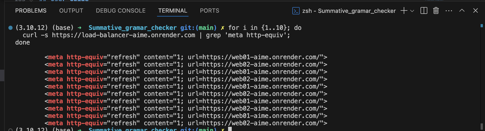

# WriteWise - Writing Assistant App

## Overview

WriteWise is a comprehensive grammar and spell checking web application that helps users improve their writing by identifying and correcting grammatical errors and spelling mistakes. The application provides real-time feedback with intelligent suggestions and features an auto-correct functionality for seamless text improvement.

## Features

- **Real-time Grammar & Spell Checking**: Identifies both grammatical and spelling errors in user text
- **Interactive Error Highlighting**: Visual highlighting of errors directly in the text input
- **Smart Suggestions**: Provides multiple correction suggestions for each identified error
- **Auto-Correct Functionality**: One-click correction of all identified errors
- **Error Filtering**: Filter results by error type (All, Spelling Only, Grammar Only)
- **Text Management**: Copy corrected text or replace original text with corrections
- **Responsive Design**: Clean, modern interface that works across devices
- **Load Balanced Deployment**: High availability through round-robin load balancing

## Technology Stack

- **Frontend**: HTML5, CSS3, JavaScript (ES6+)
- **API**: TextGears Grammar API via RapidAPI
- **Containerization**: Docker
- **Deployment**: Render.com with custom Node.js load balancer

## External API

This application uses the **TextGears Grammar API** provided through RapidAPI:

- **API Documentation**: [TextGears API on RapidAPI](https://rapidapi.com/textgears/api/textgears1)
- **Purpose**: Provides comprehensive grammar and spell checking capabilities
- **Rate Limits**: Please refer to your RapidAPI subscription limits
- **Language Support**: English (en-US)

_Special thanks to TextGears for providing this powerful grammar checking service._

## Project Structure

```
writeWise/
├── index.html          # Main HTML file
├── style.css          # Application styles
├── script.js          # Core JavaScript functionality
├── env.js             # Environment configuration
├── Dockerfile         # Docker container configuration
├── .gitignore         # Git ignore rules
├── .dockerignore      # Docker ignore rules
└── README.md          # This file
```

## Local Development

### Prerequisites

- Modern web browser (Chrome, Firefox, Safari, Edge)
- Docker (for containerization)
- API key from RapidAPI for TextGears

### Running Locally

1. **Clone the repository**:

   ```bash
   git clone https://github.com/SHYAKA-Aime/Summative_writting_assistant_App
   cd writeWise
   ```

2. **Configure API Key**:

   - Update the `x-rapidapi-key` in `env.js` with your own RapidAPI key for better security practices

3. **Open in Browser**:
   - Simply open `index.html` in your web browser
   - Or serve using a local server:
     ```bash
     python -m http.server 8080
     # or
     npx serve .
     ```

## Docker Deployment

### Image Details

- **Docker Hub Repository**: [appoemaster/summative-writing-assistant](https://hub.docker.com/r/appoemaster/summative-writing-assistant)
- **Image Name**: `appoemaster/summative-writing-assistant`
- **Tags**: `v1`, `latest`

### Build Instructions

1. **Build the Docker image locally**:

   ```bash
   docker build -t appoemaster/summative-writing-assistant:v1 .
   ```

2. **Test locally**:

   ```bash
   docker run -p 8080:8080 appoemaster/summative-writing-assistant:v1
   ```

3. **Verify functionality**:
   ```bash
   curl http://localhost:8080
   ```

### Deployment Architecture

The application is deployed using a custom load balancing solution:

#### Web Servers

- **Web01**: https://web01-aime.onrender.com/
- **Web02**: https://web02-aime.onrender.com/

#### Load Balancer Configuration

The load balancer is implemented as a Node.js application using round-robin distribution:

```javascript
const http = require("http");
const servers = [
  "https://web01-aime.onrender.com/",
  "https://web02-aime.onrender.com/",
];

let current = 0;
const server = http.createServer((req, res) => {
  // Round-robin server selection
  const target = servers[current];
  current = (current + 1) % servers.length;

  // Redirect with loading page
  const loadingPage = `<!-- Loading page HTML -->`;
  res.writeHead(200, { "Content-Type": "text/html" });
  res.end(loadingPage);
});

server.listen(process.env.PORT || 8080);
```

### Run Instructions

**On Web01 and Web02**:

```bash
# Pull the image
docker pull appoemaster/summative-writing-assistant:v1

# Run the container
docker run -d --name writewise-app --restart unless-stopped \
  -p 8080:8080 appoemaster/summative-writing-assistant:v1
```

**Environment Variables** (if using secure API key management):

```bash
docker run -d --name writewise-app --restart unless-stopped \
  -p 8080:8080 \
  -e RAPIDAPI_KEY=your_api_key_here \
  appoemaster/summative-writing-assistant:v1
```

## Load Balancer Testing

### Testing Steps

1. **Access the load balancer**: Visit the load balancer URL multiple times at

```bash
https://load-balancer-aime.onrender.com

```

or use curl

```bash
for i in {1..10}; do
  curl -s https://load-balancer-aime.onrender.com | grep 'meta http-equiv';
done

```

2. **Monitor traffic distribution**: Each request should alternate between Web01 and Web02
3. **Verify functionality**: Ensure the application works correctly from both servers

### Evidence of Load Balancing

The load balancer uses round-robin distribution which can be verified by:

- Monitoring server logs on both Web01 and Web02
- Observing the redirect pattern in browser developer tools
- Checking response times and server headers

- Refer to the attached screenshot I used to test

### App Homepage



## User Guide

### How to Use WriteWise

1. **Enter Text**: Type or paste your text in the main textarea
2. **Check Grammar**: Click the "Check text" button to analyze your text
3. **Review Suggestions**: View identified errors with suggestions in the results section
4. **Filter Results**: Use the dropdown to filter by error type (All/Spelling/Grammar)
5. **Apply Corrections**:
   - Use "Auto-Correct All" to apply all suggestions automatically
   - Or manually review and apply individual suggestions
6. **Manage Results**: Copy corrected text or replace the original text
7. **Clear**: Use the "Clear" button to reset the application

### Error Types

- **Spelling Errors**: Highlighted in red, indicates misspelled words
- **Grammar Errors**: Highlighted in blue, indicates grammatical issues

## Security Considerations

### API Key Management

- **Development**: API keys are currently embedded in the code for demo purposes
- **Production Recommendation**: Use environment variables or secure secret management
- **Docker Environment Variables**:
  ```bash
  docker run -e RAPIDAPI_KEY=your_secure_key appoemaster/summative-writing-assistant:v1
  ```

### Best Practices Implemented

- Input validation and sanitization
- Error handling for API failures
- No sensitive data stored in localStorage
- HTTPS enforcement in production

## Development Challenges & Solutions

### Challenges Encountered

1. **API Rate Limiting**:

   - **Solution**: Implemented request throttling and user feedback for rate limit exceeded scenarios

2. **Text Highlighting Complexity**:

   - **Solution**: Created a custom overlay system to highlight errors while maintaining textarea functionality

3. **Load Balancer Configuration**:

   - **Solution**: Developed custom Node.js load balancer with visual feedback during redirects

4. **Cross-Platform Compatibility**:
   - **Solution**: Used modern CSS features with fallbacks and tested across multiple browsers

### Performance Optimizations

- Efficient DOM manipulation for error highlighting
- Debounced API requests to prevent excessive calls
- Optimized CSS for smooth animations and transitions
- Lightweight Docker image using Alpine base

## API Credits & Attribution

- **TextGears Grammar API**: Provided by TextGears via RapidAPI platform
- **RapidAPI**: API marketplace and management platform
- **Google Fonts**: Inter font family for modern typography

## Development Challenges Overcome

### 1. **CORS Issues**

**Challenge**: Got CORS errors when calling TextGears API from browser.

**Solution**: Added proper headers and used correct content-type for the API request.

### 2. **Docker Static Files**

**Challenge**: HTML/CSS/JS files weren't loading properly in Docker container.

**Solution**: Used Nginx in Dockerfile to serve static files on port 8080.

### 3. **API Error Handling**

**Challenge**: App crashed when API was down or returned errors.

**Solution**: Added try-catch blocks and loading states for better user experience.

### 4. **Load Balancer Health Checks**

**Challenge**: HAProxy marked servers as down even when they were working.

**Solution**: Made sure Nginx returns 200 OK for health check requests.

### 5. **Container Networking**

**Challenge**: Load balancer couldn't reach the app containers.

**Solution**: Fixed IP addresses in HAProxy config (172.20.0.11, 172.20.0.12) and verified network setup.

**Demo Video**: [Link to your demo video]
**Live Application**: https://load-balancer-aime.onrender.com
**GitHub Repository**: https://github.com/SHYAKA-Aime/Summative_writting_assistant_App
